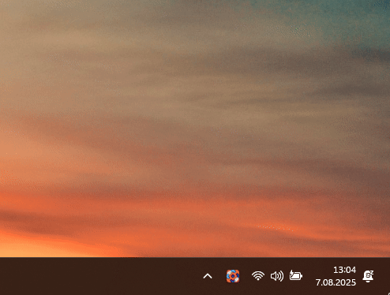

# GoodbyeDPI GUI 🇹🇷

Bu yazılım, çalışan GoodbyeDPI'ın görsel arayüzle (GUI) kolaylaştırılmış halidir.

[GoodbyeDPI](https://github.com/ValdikSS/GoodbyeDPI) ve [GoodbyeDPI-Turkey](https://github.com/cagritaskn/GoodbyeDPI-Turkey) projelerine dayanır. Derin Paket İnceleme (DPI) engellerini aşmayı hedefleyen bu araç, sistem tepsisinden kontrol edilebilen sade bir arayüzle sunulmuştur.

Proje, orijinal DPI bypass motoru ile birlikte tek seferde derlenmiş olup, betiklerle uyumlu biçimde doğrudan çalışır.

---

## Kurulum

1. GitHub "Releases" sekmesinden `GoodbyeDpiGUI.rar` dosyasını indirin.
2. Dosyayı dilediğiniz klasöre koyun (kurulum gerekmez).
3. Sağ tıklayıp **Yönetici olarak çalıştırın**.
4. Sistem tepsisine yerleşir, ikon üzerinden başlat/durdur yapılabilir.

---

---

## Kullanım

`GoodbyeDPI-GUI.exe` dosyasını çalıştırdığınız anda uygulama sistem tepsisine yerleşerek çalışmaya başlar. Arka planda sessiz şekilde DPI atlatma işlemi devam eder. Tray ikonuna sağ tıklayarak **başlat/durdur** yapabilir, çıkış (exit) seçeneğiyle tamamen kapatabilirsiniz.

> **Exit (Çıkış)** tuşuyla uygulama tamamen kapatılır. Herhangi bir çökme durumunda arkasında dosya kalıntısı bırakmaz.

---

## Kaspersky Uyarısı

Kaspersky antivirüs yazılımı GoodbyeDPI'ın çalışmasını engelleyebilir. Sadece devre dışı bırakmak yeterli değildir; tamamen kaldırılması önerilir. Alternatif olarak Windows Defender gibi daha uyumlu antivirüs çözümleri kullanılabilir.

---

## Sık Karşılaşılan Sorunlar

- **WinDivert hatası**: Antivirüs yazılımları bazı dosyaları engelleyebilir. Bu durumda antivirüs programınızı geçici olarak devre dışı bırakmayı veya uygulamayı istisnalara eklemeyi deneyin.
- **Discord güncelleme takılıyor**: Discord uygulaması bazı ağlarda engelleme tespit ettiğinde güncelleme yapamayabilir. DPI engeli kaldırıldıktan sonra, Discord'u VPN açıkken güncelleyip daha sonra normal bağlantıya dönebilirsiniz.
- **Bazı siteler yavaş ya da açılmıyor**: Uygulama etkin değilken ya da DPI tespiti başarısız olduğunda yaşanabilir. Uygulama arayüzünden çalıştığından emin olun.

---

## Lisans

Apache License 2.0 — Ayrıntılar için [LICENSE](./LICENSE) dosyasına bakabilirsiniz.

Bu proje [Apache License, Version 2.0, January 2004](http://www.apache.org/licenses/) lisansı kapsamında sunulmuştur. Yazılımı kullanan herkes lisans şartlarını okumalı ve kabul etmelidir.

---

## Yasal Uyarı

> **Önemli:**
> 
> Bu uygulamanın kullanımından doğan her türlü yasal sorumluluk kullanan kişiye aittir. Uygulama yalnızca eğitim ve araştırma amaçları ile yazılmış ve düzenlenmiş olup; bu uygulamayı bu şartlar altında kullanmak ya da kullanmamak kullanıcının kendi seçimidir. Açık kaynak kodlarının paylaşıldığı bu platformdaki düzenlenmiş bu proje, bilgi paylaşımı ve kodlama eğitimi amaçları ile yazılmış ve düzenlenmiştir.
> Bu uygulamanın kullanımından doğan her türlü yasal sorumluluk kullanan kişiye aittir. Uygulama yalnızca eğitim ve araştırma amaçları ile yazılmış ve düzenlenmiş olup; bu uygulamayı bu şartlar altında kullanmak ya da kullanmamak kullanıcının kendi seçimidir. Açık kaynak kodlarının paylaşıldığı bu platformdaki düzenlenmiş bu proje, bilgi paylaşımı ve kodlama eğitimi amaçları ile yazılmış ve düzenlenmiştir. Uygulama yalnızca eğitim ve araştırma amaçları ile yazılmış ve düzenlenmiş olup; bu uygulamayı bu şartlar altında kullanmak ya da kullanmamak kullanıcının kendi seçimidir. Açık kaynak kodlarının paylaşıldığı bu platformdaki düzenlenmiş bu proje, bilgi paylaşımı ve kodlama eğitimi amaçları ile yazılmış ve düzenlenmiştir.

---

## Geliştirme Notu

Bu proje boş zamanlarda geliştirilmeye devam edecek olup, karşılaşılan hatalar ve öneriler doğrultusunda güncellemeler yapılacaktır.

Script dosyaları ve Türkiye’ye özel konfigürasyonlar için:
👉 [https://github.com/cagritaskn/GoodbyeDPI-Turkey](https://github.com/cagritaskn/GoodbyeDPI-Turkey)

Her türlü destek, öneri ve katkı memnuniyetle karşılanır.

